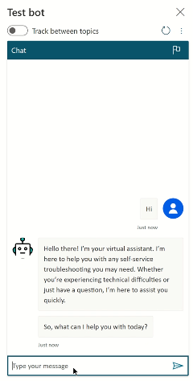
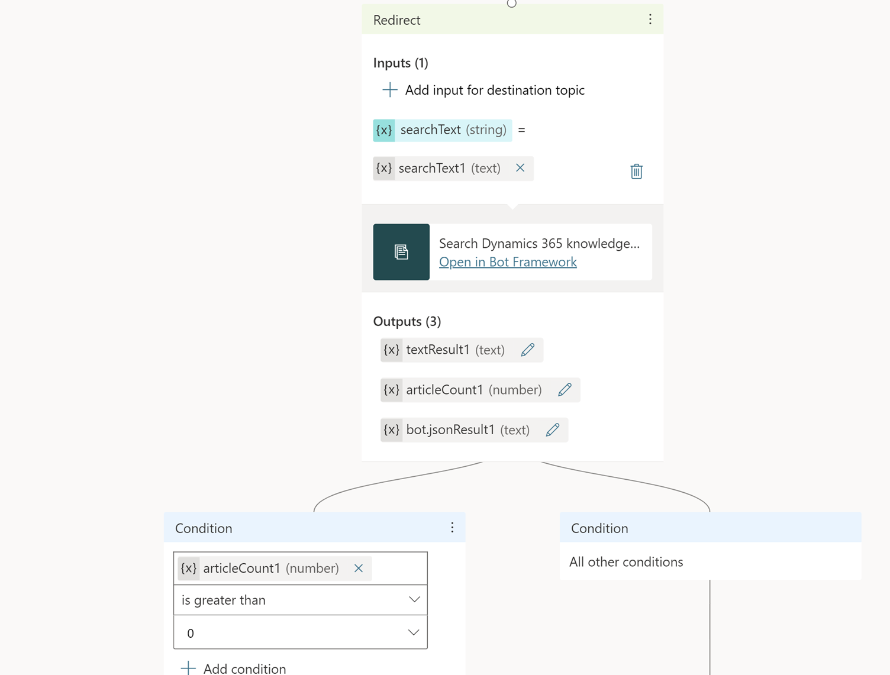
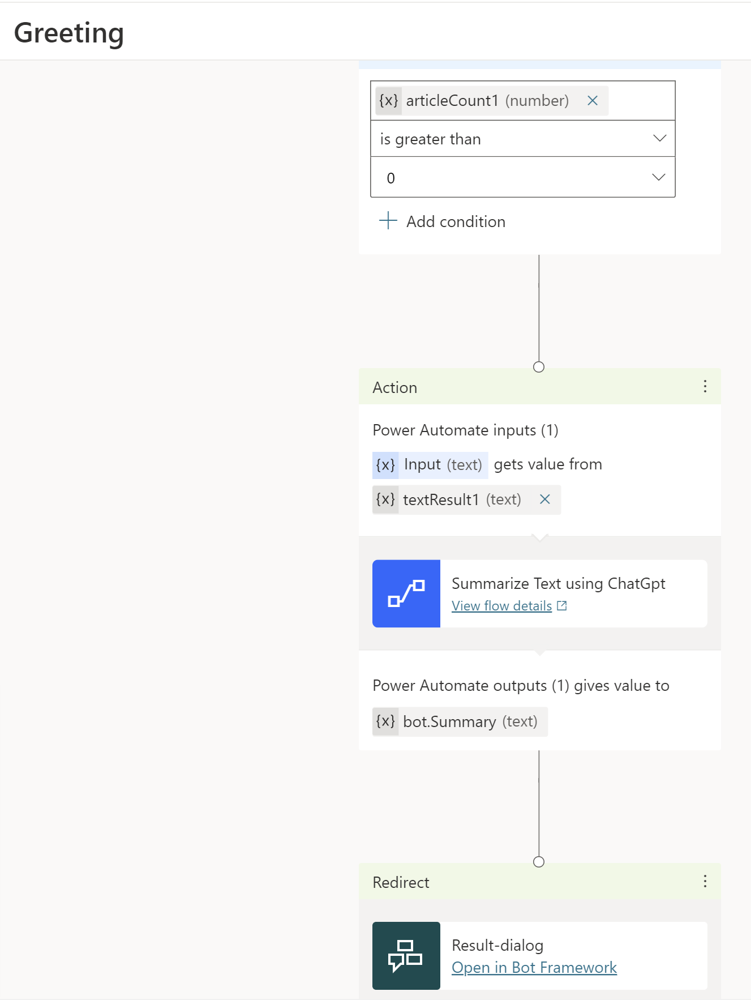
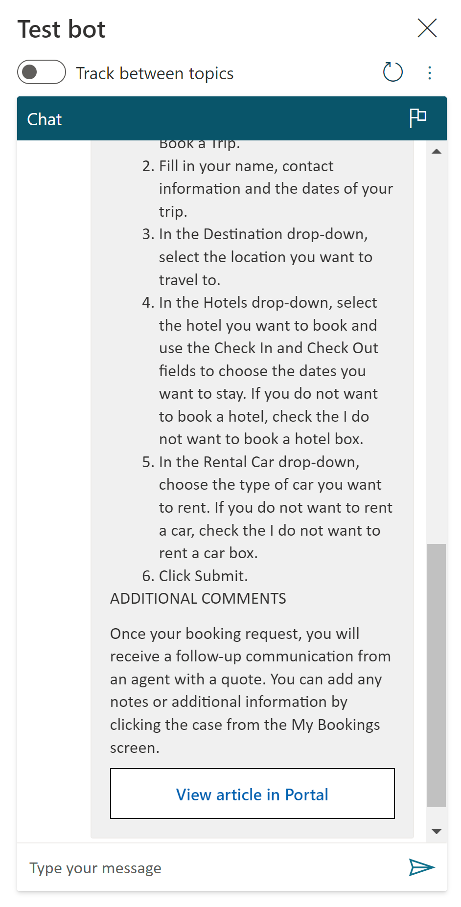

# Summarizing Dynamics 365 Knowledge Base with ChatGPT for Efficient Customer Support

## Introduction
In today's fast-paced world, customers expect quick and efficient solutions to their queries. Integrating a knowledge base search into your bots can provide customers with self-service options, allowing them to find the information they need quickly and easily. 

In our [previous article](https://cloudblogs.microsoft.com/dynamics365/it/2022/09/07/empower-self-service-by-adding-knowledge-base-search-to-your-bots), we discussed the benefits of knowledge base integration and provided step-by-step instructions for adding this feature to your bots using Microsoft's Power Virtual Agents. 

In this new article, we will take things a step further and explore how you can integrate the knowledge base from Dynamics 365 with ChatGPT for even more efficient and effective summarization. By combining the power of Dynamics 365's knowledge base with ChatGPT's natural language processing capabilities, you can provide customers with even more accurate and personalized responses to their queries.  
Watch the following video  

## Add the action to your topic in your self-service bots
In our previous article, we added the search flow action to the “Greetings” topic in our bot. The “Greetings” topic has preconfigured trigger phrases and a question. At the output of the question, we had called the “Search Dynamics 365 knowledge articles” flow action, as shown in the following figure.

The action’s output—that is, the result of the knowledge base search—is stored in the variable “bot.jsonResult1 (text)” and the count of the articles returned in the search result is stored in the variable “articleCount1 (number)”, which is redirected to condition to check if the search returned any article or not i.e. “articleCount1 (number)” is greater than 0.

## Create a Power Automate for summarizing the article using ChatGPT
In this example, we will demonstrate how to use an HTTP action to process text received from the PVA bot and invoke ChatGPT's API for article summarization. The result of the action is then returned to the PVA bot. 

The following are the specifics of the HTTP action required to invoke ChatGPT's API. To use this action, you must obtain your own secret from the OpenAI portal and substitute the value of the "Authorization" header with "Bearer <replace with actual token>". Use the following URL to go to [OpenAI portal](https://platform.openai.com/docs/api-reference) and click on view API keys and follow the steps to obtain and key.

## Incorporate an action into your self-service bots that triggers Power Automate
Next, we will incorporate an action that triggers Power Automate to invoke ChatGPT's API for article summarization based on the output of the condition. The output of the Power Automate is then redirected to the "Result-dialog" to display the result in an adaptive card.

## Save the topic and publish the bot.
The following illustration shows the output from our example.

When the customer selects Show Content, the chat displays a summary of the knowledge article, along with a link to view it in the portal.

For more information about showing the results in an adaptive card, go to Render results in the documentation.

## Artifacts
Here’s the [link](./artifacts/SummarizeKBArticleusingGPT_1_0_0_1.zip) to download the solution zip file.
