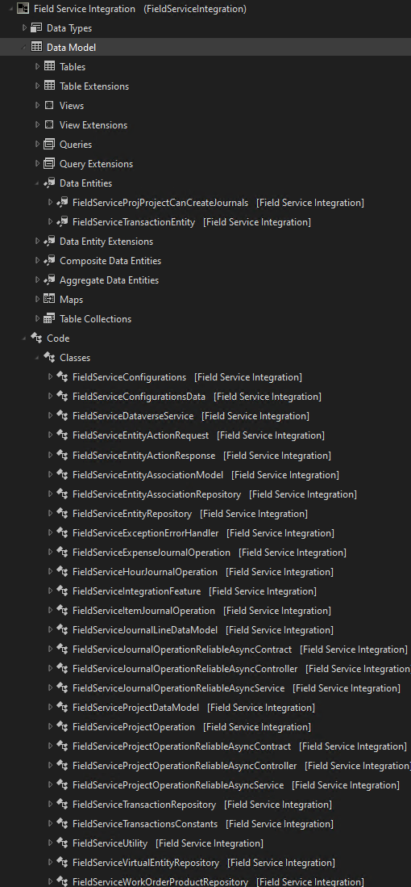
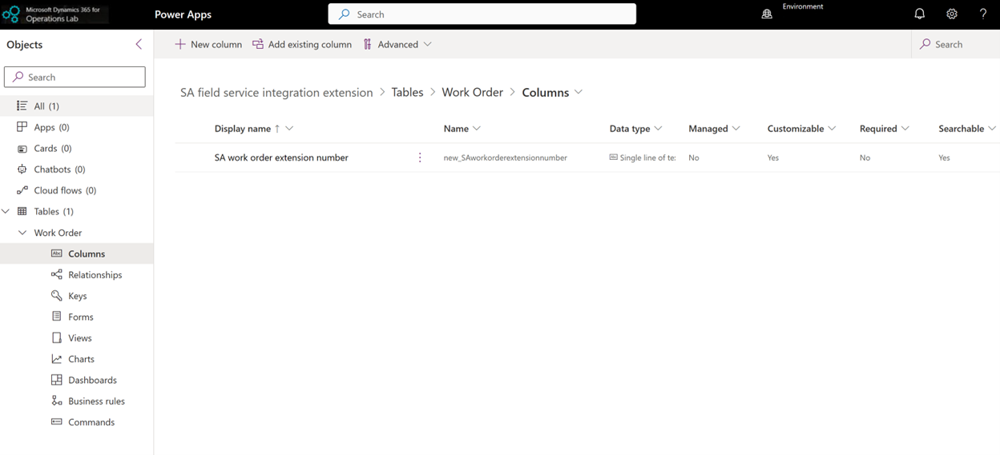
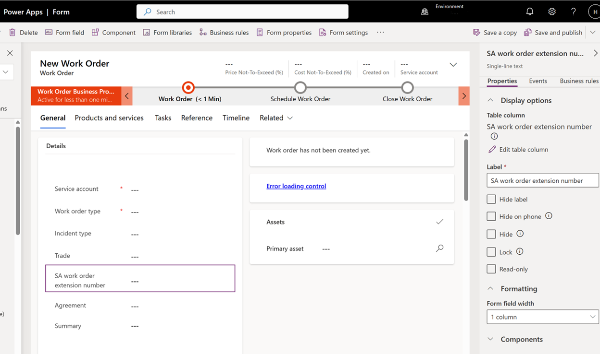
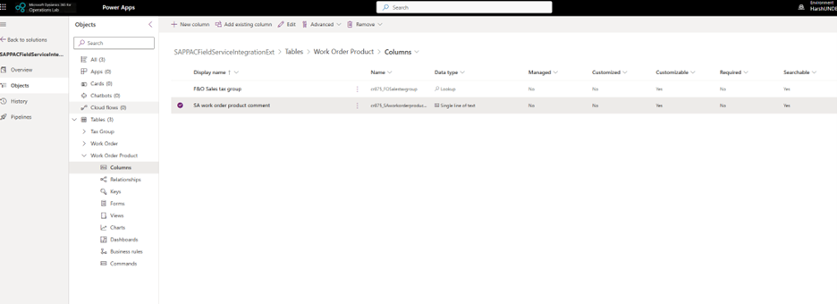
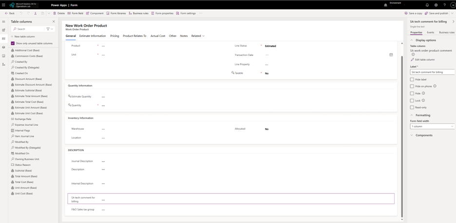
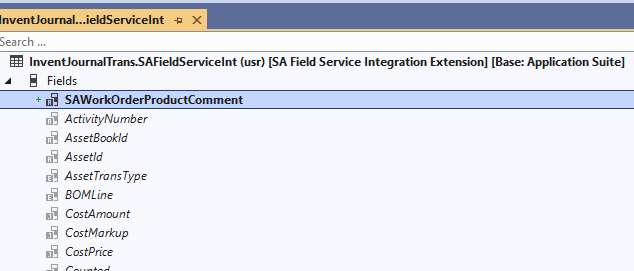
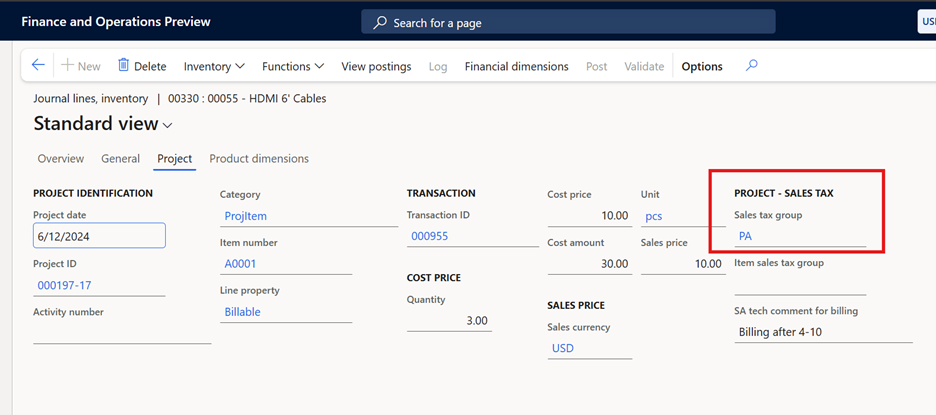
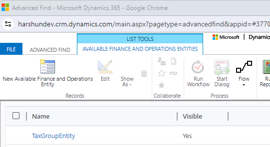
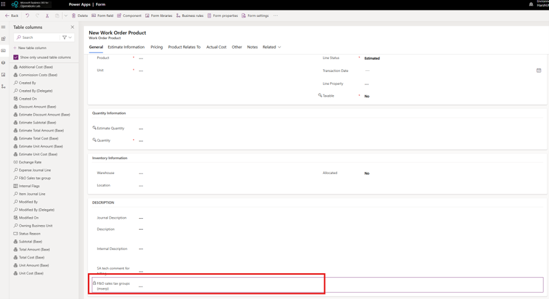

# Dynamics 365 Field Service Integration with Finance and Operations Technical Architecture and Extension

# Architecture
Microsoft recently released Field Service integration with Finance and Operations apps to bring both of these Dynamics 365 apps together [Field Service integration with finance and operations applications](https://learn.microsoft.com/en-us/dynamics365/field-service/finance-operations-integration)

This integration is built on the existing capabilities of the Dynamics 365 platform. The Field Service F&O Integration Transaction table (msdyn_fnointegrationjournaltrans) in Dataverse stores transaction logs   that are synchronized based on events in the Field Service app. For instance, when a work order is created with an F&O project, such eligible transaction is stored in this table. An asynchronous job in Dataverse then picks up 'unsynced' transactions from this table and sends them to F&O using OData. In F&O, the new data entity FieldServiceTransactionEntity   is developed that uses SysODataAction to create projects and project journals (Hour/Expense/Item) based on the transaction type. A reliable asynchronous framework in F&O then processes the OData request to create either a Project or Project journals using F&O business logic. Since a finance and operations entity is directly invoked in all operations, any business logic on the entity or its backing tables is also invoked.


# Extensibility
Although we strive to provide the best possible out-of-the-box experience for our customers, we understand that each business is unique. As a result, you may need to extend Dynamics 365 to support the specific requirements of your business. This integration supports extensibility using existing extension patterns.
Developers can leverage [Dynamics 365 F&O extension patterns](https://learn.microsoft.com/en-us/dynamics365/fin-ops-core/dev-itpro/extensibility/extensibility-home-page) and [Power platform Dataverse extension](https://learn.microsoft.com/en-us/training/paths/extend-power-platform-dataverse) to support extension with this integration.

To begin   with, developers can use [Unified development environment](https://learn.microsoft.com/en-us/power-platform/admin/unified-experience/tutorial-deploy-new-environment-with-erp-template?tabs=PPAC#step-by-step-provisioning-guide) for both Dynamics 365 F&O and FS apps, it provides ability for developers to install and configure development tools e.g. Visual Studio [dev tools](https://learn.microsoft.com/en-us/power-platform/developer/unified-experience/finance-operations-install-config-tools). Developers can use Power Platform [maker portal](https://make.powerapps.com/) to extend Dynamics 365 Field Service application.

Microsoft ships Field Service Integration model in Dynamics 365 F&O standard product, developers have ability to view the code, debug and even extend it using existing Dynamics 365 F&O extension patterns.



# Application Lifecycle Management (ALM)

The application lifecycle for an end-to-end solution may encompass both finance and operations as well as Dataverse. Leverage existing solution management and ALM processes for [Dynamics 365 Field Service extension](https://learn.microsoft.com/en-us/power-platform/alm/organize-solutions). Leverage existing ALM processes for [Dynamics 365 F&O Implement application lifecycle management in finance and operations apps](https://learn.microsoft.com/en-us/training/modules/application-lifecycle-finance-operations/)

For instance, if you have a need to add a field to the Dynamics 365 Field Service work order table using an extension and transfer that field value to Dynamics 365 F&O through integration, you will need to extend the ProjTable in Dynamics 365 F&O and extend the class(es) in Dynamics 365 F&O to transfer the new field value from FS to F&O. As a result, developers must extend both apps, manage the solution in Field Service and the model in F&O, and plan to deploy changes to both apps simultaneously using existing application lifecycle management processes.

# Extensibility Example 1:
Below examples are provided based on 10.0.40 of F&O application version and these should be used as an aspiration, developers must access the right extension pattern for their implementation and raise [extensibility request](https://learn.microsoft.com/en-us/dynamics365/fin-ops-core/dev-itpro/extensibility/extensibility-requests) if right extension hook points are not available.

Consider scenario to add a new custom field in Dynamics 365 Field Service work order table, move and store that custom field value to Dynamics 365 F&O through integration in sub-project in F&O.

Add a field to the Dynamics 365 Field Service work order table using an extension and transfer that field value to Dynamics 365 F&O through integration, you will need to extend the ProjTable in Dynamics 365 F&O and extend the class(es) in Dynamics 365 F&O to transfer the new field value from FS to F&O.

## Extension in Field Service:
Consider scenario to add a field namely ‘SA work order extension number’ (String = 10) to the Dynamics 365 Field Service work order table using an extension. You create new custom solution in Dataverse and add field in Work order table using maker portal and add the field in the Work order from as shown below, save and publish the customizations.


Consider to add this field in work order form.


## Extension in F&O:
Add field in Dynamics 365 F&O in ProjTable (by following Dynamics 365 F&O dev best practices of creating EDT etc.


Essentially, we’d like to hook to FieldServiceProjectOperation>createProject() method, reason being to maintain the right status integrity in Dataverse as explained below:

Below is the standard code flow in FieldServiceProjectOperationReliableAsyncService class

* Change the status to Processing	in FieldServiceProjectOperationReliableAsyncService > processOperation() [dataverseService.projectTransactionInProgress();]
* Get the project data from work order [FieldServiceProjectDataModel projectDataModel = dataverseService.projectDataFromWorkOrder();]	
* Create the project [projectOperation.createProject();]
    * Extension - Once the project is created in F&O by standard integration code, retrieve extended fields from FS work order e.g.  “SA work order extension number” and update this in F&O project.
* Change the status to complete in FieldServiceProjectOperationReliableAsyncService > processOperation() [dataverseService.projectTransactionCompleted(projectDataModel);]

Class 1 – create extension of FieldServiceProjectDataModel data-contract to get/set extension field
```
//This is extension of FieldServiceProjectDataModel to get/set additional custom fields (extension) for Project
[ExtensionOf(classStr(FieldServiceProjectDataModel))]
final class FieldServiceProjectDataModel_SAFieldServiceInt_Extension
{
    public SAWorkOrderExtensionNumber   workOrderExtensionNumber;

    [DataMember('SAWorkOrderExtensionNumber')]
    public ProjName parmSAWorkOrderExtensionNumber(SAWorkOrderExtensionNumber _workOrderExtensionNumber = workOrderExtensionNumber)
    {
        workOrderExtensionNumber = _workOrderExtensionNumber;
        return workOrderExtensionNumber;
    }

}
```
Class 2 – This is extension (COC) of FieldServiceWorkOrderRepository class to retrieve extension field from Field Service workorder table, and set it in FieldServiceProjectDataModel data-contract.
```
using Microsoft.Xrm.Sdk;
using Microsoft.Xrm.Sdk.Query;
using System.Linq;
//This is extension of FieldServiceWorkOrderRepository class to retrieve any additional custom fields from work order and set it to FieldServiceProjectDataModel
[ExtensionOf(classStr(FieldServiceWorkOrderRepository))]
final class FieldServiceWorkOrderRepository_SAFieldServiceInt_Extension
{
    public void retrieveProjectDataFromWorkOrder(FieldServiceProjectDataModel _projectDataModel)
    {
        
        AttributeCollection attributeCollection;
        System.Object getEntityValue(str attributeName)
        {
            System.Object entityValue = null;
            if (attributeCollection)
            {
                attributeCollection.TryGetValue(attributeName, byref entityValue);
            }

            return entityValue;
        }
        ;

        next retrieveProjectDataFromWorkOrder(_projectDataModel);

        // Required for local method

        QueryExpression query = new QueryExpression('msdyn_workorder');
        ColumnSet columnSet = new ColumnSet();
        //name fields are case sensitive
        columnSet.AddColumn('new_saworkorderextensionnumber');

        query.ColumnSet = columnSet;
        FilterExpression criteria = query.Criteria;

        FilterExpression woFilter = new FilterExpression();
        woFilter.FilterOperator = FieldServiceTransactionsConstants::OPERATOR_AND;
        woFilter.AddCondition(new ConditionExpression('msdyn_workorderid', FieldServiceTransactionsConstants::CONDITION_EQUAL, workOrderGuidId));
        criteria.AddFilter(woFilter);

        EntityCollection entityCollection = organizationService.RetrieveMultiple(query);
        if (entityCollection != null && entityCollection.Entities != null && entityCollection.Entities.Count > 0)
        {
            
            Microsoft.Xrm.Sdk.Entity[] entityArray = entityCollection.Entities.ToArray();
            Microsoft.Xrm.Sdk.Entity entity = entityArray.GetValue(0);
            attributeCollection = entity.Attributes;

            str currFieldStrValue = FieldServiceUtility::getEntityStringValue(getEntityValue('new_saworkorderextensionnumber'));
            _projectDataModel.parmSAWorkOrderExtensionNumber(currFieldStrValue);                    
        }
    }
}
```
Class 3 – This is extension class to update Project in F&O with extension field 
```
//This is extension   of FieldServiceProjectOperation to update the custom fields in ProjTable
[ExtensionOf(classStr(FieldServiceProjectOperation))]
final class FieldServiceProjectOperation_SAFieldServiceInt_Extension
{
    public void createProject()
    {
        next createProject();
        changecompany(projectDataModel.parmDataAreaId())
        {
            ProjTable parentProjTable = ProjTable::find(projectDataModel.parmSubprojectId(),true);
            if (parentProjTable)
            {
                ttsbegin;
                parentProjTable.SAWorkOrderExtensionNumber = projectDataModel.parmSAWorkOrderExtensionNumber();
                parentProjTable.doupdate();
                ttscommit;
            }
        }
    }
}
```
# Extensibility Example 2:
Consider scenario to add a new custom field in Dynamics 365 Field Service work order product table, move and store that custom field value to Dynamics 365 F&O through integration in project > item journal in F&O.

## Extension in Field Service:

Add a new custom field namely ‘SA tech comment for billing’ (String = 100) to the Dynamics 365 Field Service work order product table using an extension. You can create new custom solution in Dataverse and add field in Work order product table using maker portal and add the field in the Work order product from as shown below, save and publish the customizations.



Consider to add this field in work order product form.


## Extension in F&O:
Add field in Dynamics 365 F&O in InventJournalTrans table (by following Dynamics 365 F&O dev best practices of creating EDT etc.:


Essentially, we’d like to hook to FieldServiceItemJournalOperation>createJournal() method, reason being to maintain the right status integrity in Dataverse as explained below:
Below is the standard code flow in FieldServiceJournalOperationReliableAsyncService class
* Change the status to Processing	in FieldServiceJournalOperationReliableAsyncService > processOperation() [dataverseService. journalTransactionInProgress ();]
* Get the item journal data from work order product table [FieldServiceJournalLineDataModel journalLineDataModel = this.retrieveJournalDataFromDataverseEntity(transJournalType, dataverseService);]	
* Create the project item journal [journalOperation.createJournal();]
 * Extension - Once the item journal line is created in F&O by standard integration code, retrieve extended (custom) fields from FS work order product e.g.  “SA tech comment for billing” and update this in F&O project item journal. 
* Change the status to complete in FieldServiceJournalOperationReliableAsyncService > processOperation() [dataverseService.journalTransactionCompleted (journalLineDataModel);]

Class 1 – create extension of FieldServiceJournalLineDataModel data-contract to get/set extension field
```
//This is extension of FieldServiceJournalLineDataModel to get/set additional custom fields (extension) for Project item journal
[ExtensionOf(classStr(FieldServiceJournalLineDataModel))]
final class FieldServiceJournalLineDataModel_SAFieldServiceInt_Extension
{
    public SAWorkOrderProductComment wOProductComment;

    [DataMember('SAWorkOrderProductComment')]
    public SAWorkOrderProductComment parmSAWOProductComment(SAWorkOrderProductComment _wOProductComment = wOProductComment)
    {
        wOProductComment = _wOProductComment;
        return wOProductComment;
    }

}
```
Class 2 – This is extension (COC) of FieldServiceWorkOrderProductRepository class to retrieve extension field from Field Service workorderproduct table, and set it in FieldServiceJournalLineDataModel data-contract.
```
using Microsoft.Xrm.Sdk;
using Microsoft.Xrm.Sdk.Query;
using System.Linq;
//This is extension of FieldServiceWorkOrderProductRepository class to retrieve any additional custom fields from work order product table
//and set it to FieldServiceJournalLineDataModel
[ExtensionOf(classStr(FieldServiceWorkOrderProductRepository))]
final class FieldServiceWorkOrderProductRepository_SAFieldServiceInt_Extension
{
    public void retrieveJournalDataFromWorkOrderProduct(FieldServiceJournalLineDataModel _journalLineDataModel)
    {
        AttributeCollection attributeCollection;
        System.Object getEntityValue(str attributeName)
        {
            System.Object entityValue = null;
            if (attributeCollection)
            {
                attributeCollection.TryGetValue(attributeName, byref entityValue);
            }

            return entityValue;
        }
        ; // Required for local method

        next retrieveJournalDataFromWorkOrderProduct(_journalLineDataModel);

        QueryExpression query = new QueryExpression('msdyn_workorderproduct');
        ColumnSet columnSet = new ColumnSet();
        columnSet.AddColumn('cr875_saworkorderproductcomment');

        query.ColumnSet = columnSet;
        FilterExpression criteria = query.Criteria;

        FilterExpression wopFilter = new FilterExpression();
        wopFilter.FilterOperator = FieldServiceTransactionsConstants::OPERATOR_AND;
        wopFilter.AddCondition(new ConditionExpression('msdyn_workorderproductid', FieldServiceTransactionsConstants::CONDITION_EQUAL, workOrderProductGuidId));
        criteria.AddFilter(wopFilter);

        EntityCollection entityCollection = organizationService.RetrieveMultiple(query);
        if (entityCollection != null && entityCollection.Entities != null && entityCollection.Entities.Count > 0)
        {
            Microsoft.Xrm.Sdk.Entity[] entityArray = entityCollection.Entities.ToArray();
            Microsoft.Xrm.Sdk.Entity entity = entityArray.GetValue(0);
            attributeCollection = entity.Attributes;

            str currFieldStrValue = FieldServiceUtility::getEntityStringValue(getEntityValue('cr875_saworkorderproductcomment'));
            _journalLineDataModel.parmSAWOProductComment(currFieldStrValue);
        }
    }
}
```
Class 3 – This is extension class to update item journal in F&O with extension field (this is not recommended to use if you have setup to create/post journal at the time of item is used). Instead of createJournal(), we should look at setJournalLineFields(), currently this method is private, therefore, can’t be extended.
```
//This is extension of FieldServiceItemJournalOperation to update the custom fields in InventJournalTrans
[ExtensionOf(classStr(FieldServiceItemJournalOperation))]
final class FieldServiceItemJournalOperation_SAFieldServiceInt_Extension
{
    public void createJournal() 
    {
        InventJournalTable    journalTable;
        InventJournalTrans    journalTrans;
        next createJournal();
        changecompany(journalLineDataModel.parmDataAreaId())
        {
            ttsbegin;
            if (this.SAjournalExists())
            {
                JournalId InventJournalId = journalLineDataModel.parmJournalId();
                journalTable = InventJournalTable::find(InventJournalId);
                select firstonly forupdate journalTrans where journalTrans.journalid == InventJournalId
                                && journalTrans.Linenum == journalLineDataModel.parmLineNum();
                journalTrans.SAWorkOrderProductComment = journalLineDataModel.parmSAWOProductComment();
                journalTrans.doupdate();
            }
            ttscommit;
        }
    }

    private boolean SAjournalExists()
    {
        ProjectItemJournalTableEntity projectItemJournalTableEntity;
        select firstonly RecId from projectItemJournalTableEntity
                    where projectItemJournalTableEntity.DataAreaId == journalLineDataModel.parmDataAreaId() &&
                          projectItemJournalTableEntity.JournalId == journalLineDataModel.parmJournalId();

        return projectItemJournalTableEntity.RecId != 0;
    }

}
```
# Extensibility Example 3:
Consider scenario to add a new custom field in Dynamics 365 Field Service work order product table, the value of this field needs to come from Dynamics 365 F&O after creating project item journal in F&O. For example, sales tax group is assigned in Dynamics 365 F&O based item setup etc. Once the journal line is created/(and posted), you need to view Sales tax group in Dynamics 365 Field Service work order product table.


## Extension in Field Service:
There is F&O virtual table available for TaxGroupEntity, enable this entity. 


Since it’s virtual entity, it will be available as mserp_taxgroupentity


Add new field as Lookup to mserp_taxgroupentity in work order product table (i.e. Sales tax groups (mserp)) as non-editable field.


Consider to add this field in work order product form.


## Extension in F&O:

Class 1 – create extension of FieldServiceEntityAssociationRepository to generate GUID of sales tax group. 
```
[ExtensionOf(classStr(FieldServiceEntityAssociationRepository))]
final class FieldServiceEntityAssociationRepository_SAFieldServiceInt_Extension
{
    public guid retrieveItemSalesTaxEntityId(str _projTaxgroupID)
    {
        guid projTaxGroupId = emptyGuid();
        if (_projTaxgroupID)
        {
            projTaxGroupId = this.retrieveEntityGuidUsingFieldValueAndDataAreaId('mserp_taxgroupentity',
                                                                          'mserp_taxgroupcode',
                                                                           _projTaxgroupID,
                                                                           'mserp_dataareaid',
                                                                            dataAreaId);
        }

        return projTaxGroupId;
    }

}
```
Class 2 – This is extension (COC) of FieldServiceWorkOrderProductRepository class to update work order product table for sales tax group virtual entity GUID.
```
using Microsoft.Xrm.Sdk;
using Microsoft.Xrm.Sdk.Query;
using System.Linq;
//This is extension of FieldServiceWorkOrderProductRepository class to retrieve any additional custom fields from work order product table
//and set it to FieldServiceJournalLineDataModel
[ExtensionOf(classStr(FieldServiceWorkOrderProductRepository))]
final class FieldServiceWorkOrderProductRepository_SAFieldServiceInt_Extension
{
    
    public void updateWorkOrderProductRecordWithItemJournalLine(guid _itemJournalLineGuidId, JournalId _journalId, LineNum _journalLineNumber)
    {
        next updateWorkOrderProductRecordWithItemJournalLine(_itemJournalLineGuidId,_journalId,_journalLineNumber);
        changecompany(dataAreaId)
        {
            ProjectItemJournalTransEntity itemJournaLineEntity;
            select firstonly ProjectTaxGroupId  from itemJournaLineEntity
                    where itemJournaLineEntity.DataAreaId == dataAreaId &&
                          itemJournaLineEntity.JournalId == _journalId &&
                          itemJournaLineEntity.LineNum == _journalLineNumber;


            FieldServiceEntityAssociationRepository entityAssociationRepository = FieldServiceEntityAssociationRepository::newFromTransactionParameters(organizationService, entityActionRequest);

            guid projtaxGrID = entityAssociationRepository.retrieveItemSalesTaxEntityId(itemJournaLineEntity.ProjectTaxGroupId);

           // entityAssociationRepository.addMissingLookupAssociationEntry(FieldServiceDataverseLookupType::WorkOrderProductItemJournal, workOrderProductGuidId, projtaxGrID);
            this.updateWorkOrderProductWithTaxGroupID(projtaxGrID);
        }
    }

    public void updateWorkOrderProductWithTaxGroupID(guid projtaxGrID)
    {
        QueryExpression query = new QueryExpression('msdyn_workorderproduct');

        FilterExpression criteria = query.Criteria;
        criteria.AddCondition(new ConditionExpression('msdyn_workorderproductid', FieldServiceTransactionsConstants::CONDITION_EQUAL, workOrderProductGuidId));
        criteria.AddCondition(new ConditionExpression('cr875_fosalestaxgroupsmserp', FieldServiceTransactionsConstants::CONDITION_EQUAL, projtaxGrID));
        //
        

        EntityCollection entityCollection = organizationService.RetrieveMultiple(query);
        boolean associationExists = (entityCollection != null && entityCollection.Entities != null && entityCollection.Entities.Count > 0);

        // Update Work Order product record if Work Order Service has no association with FnO tax groupID.
        if (!associationExists)
        {
            Entity woEntity = new Entity('msdyn_workorderproduct', workOrderProductGuidId);
            AttributeCollection attributeCollection = woEntity.Attributes;
            attributeCollection.Add('cr875_fosalestaxgroupsmserp', new EntityReference('mserp_taxgroupentity', projtaxGrID));
            organizationService.Update(woEntity);
        }
    }

}
```
